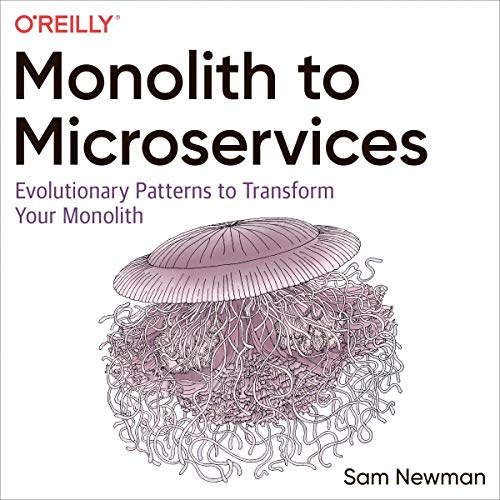

# Desacoplar sistemas com Change Data Capture

## Contexto

Processo de modernização de tecnologia que compreende o opção por um estilo arquitetural de microsserviços, compreendendo um **desafio não trivial de fuga e quebra de um sistema monolito legado**.

## Por quê

Existem muitas ferramentas e abordagens para a quebra de monolitos.  
Sam Newman catalogou 10+ padrões em seu livro *Monolith to Microservices: Evolutionary Patterns to Transform Your Monolith*.

Um motivo torna o Change Data Capture particularmente atrativo: seu uso é **extensível e sem impacto direto nas camadas de aplicação**.

Assim, quando bem sucedida, **a arquitetura de CDC pode continuar trazendo retornos sobre o investimento inicial**.  
Também pode contribuir com uma jornada por uma arquitetura orientada a eventos, entregando mais disponibilidade e autonomia devido ao menor acoplamento entre sistemas.

## Futurologia

Não existe bala de prata, certo? CDC não vai resolver todos os problemas. Além disso com o uso do padrão e de abordagens orientadas a eventos, novos problemas virão oO.

## Sobre o Change Data Capture

> Change Data Capture, or CDC, is an older term for a system that monitors and captures the changes in data so that other software can respond to those changes.
>
>Data warehouses often had built-in CDC support, since data warehouses need to stay up-to-date as the data changed in the upstream OLTP databases.
>
>https://debezium.io/documentation/faq/#what_is_change_data_capture

## Desenho de Arquitetura

>Debezium is a set of distributed services that capture row-level changes in your databases so that your applications can see and respond to those changes.
>
> https://debezium.io/documentation/faq/#what_is_debezium

## Referências

https://debezium.io/community/users/

https://debezium.io/documentation/reference/1.5/connectors/postgresql.html

https://debezium.io/documentation/reference/1.5/connectors/postgresql.html#setting-up-postgresql

https://debezium.io/

### (Livro) Monolith to Microservices: Evolutionary Patterns to Transform Your Monolith

